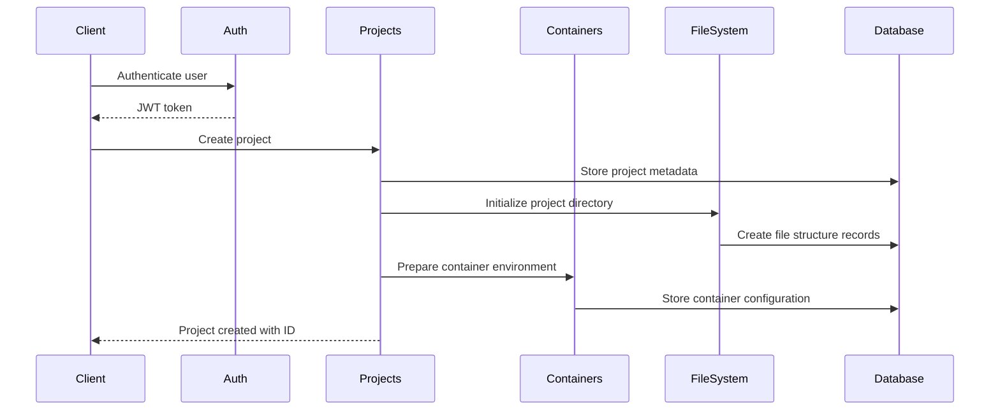
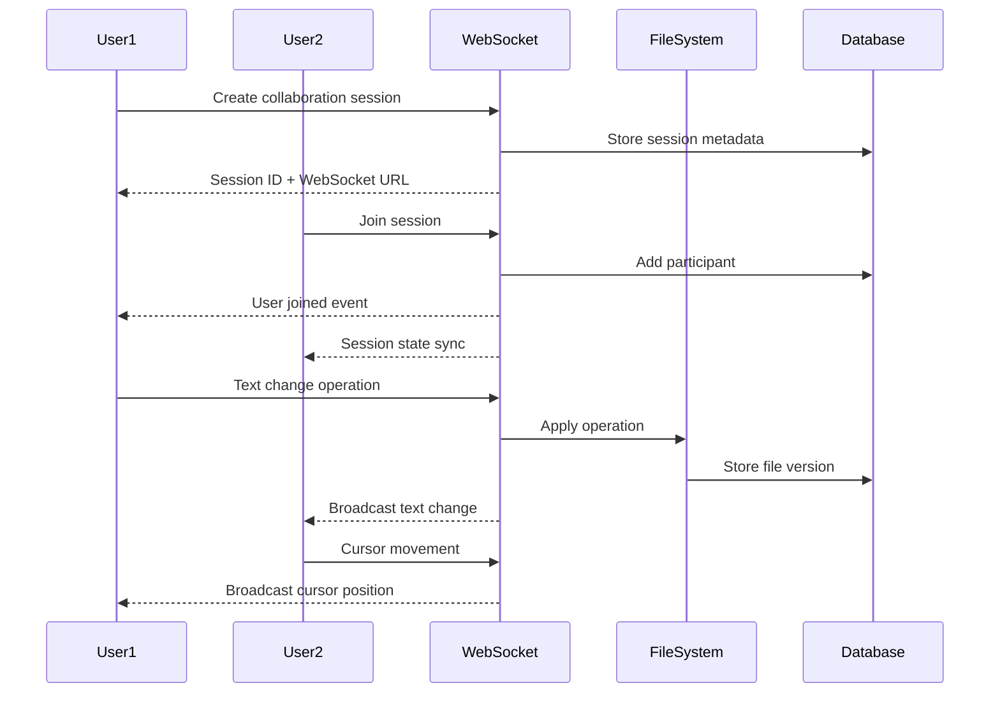
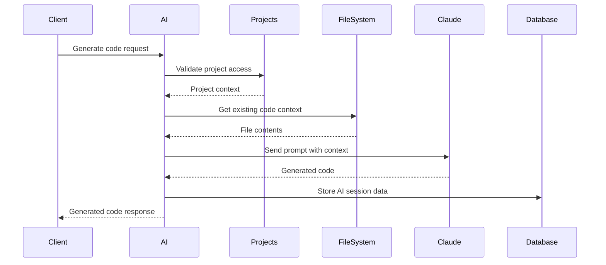
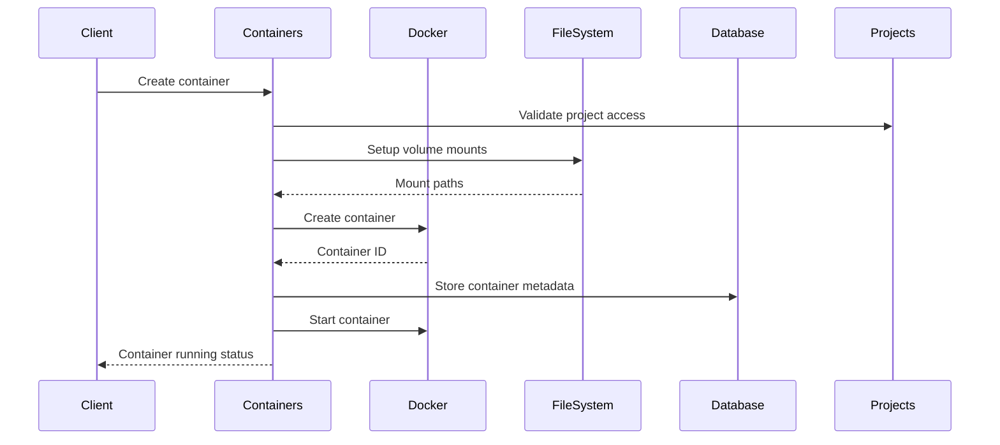

# Service Interaction Patterns

## Overview

This document describes how the various microservices in Vaporform interact with each other to provide a cohesive development environment experience.

## Service Architecture

```
┌─────────────────────────────────────────────────────────────────┐
│                        Frontend Layer                           │
│  ┌─────────────────┐  ┌─────────────────┐  ┌─────────────────┐ │
│  │  VSCode Web     │  │   Web Client    │  │  Mobile App     │ │
│  └─────────────────┘  └─────────────────┘  └─────────────────┘ │
└─────────────────────────────────────────────────────────────────┘
                                │
                                ▼
┌─────────────────────────────────────────────────────────────────┐
│                        API Gateway                              │
│                    (Encore.ts Router)                          │
└─────────────────────────────────────────────────────────────────┘
                                │
                ┌───────────────┼───────────────┐
                ▼               ▼               ▼
┌─────────────────┐  ┌─────────────────┐  ┌─────────────────┐
│ Authentication  │  │    Projects     │  │      AI         │
│    Service      │  │    Service      │  │   Service       │
└─────────────────┘  └─────────────────┘  └─────────────────┘
                                │
                ┌───────────────┼───────────────┐
                ▼               ▼               ▼
┌─────────────────┐  ┌─────────────────┐  ┌─────────────────┐
│   Containers    │  │   File System   │  │   WebSocket     │
│    Service      │  │    Service      │  │   Service       │
└─────────────────┘  └─────────────────┘  └─────────────────┘
                                │
                                ▼
┌─────────────────────────────────────────────────────────────────┐
│                      Database Layer                             │
│  ┌─────────────────┐  ┌─────────────────┐  ┌─────────────────┐ │
│  │   PostgreSQL    │  │      Redis      │  │   File System   │ │
│  │   (Metadata)    │  │    (Cache)      │  │   (Storage)     │ │
│  └─────────────────┘  └─────────────────┘  └─────────────────┘ │
└─────────────────────────────────────────────────────────────────┘
```

## Service Dependencies

### Core Dependencies
1. **Authentication Service** → Database (User data)
2. **Projects Service** → Authentication, Database
3. **AI Service** → Authentication, Projects, External AI APIs
4. **Containers Service** → Authentication, Projects, Docker Engine
5. **File System Service** → Authentication, Projects, File Storage
6. **WebSocket Service** → Authentication, Projects, File System

### External Dependencies
- **Docker Engine**: Container orchestration
- **Claude AI API**: AI-powered features
- **File Storage**: Project file persistence
- **Redis Cache**: Session management and real-time state

## Interaction Patterns

### 1. Project Creation Workflow



### 2. Real-time Collaboration Session



### 3. AI Code Generation Flow



### 4. Container Lifecycle Management



## Data Flow Patterns

### 1. Authentication Flow

```typescript
// Authentication verification middleware
export async function authMiddleware(token: string): Promise<AuthData> {
  // Verify JWT token
  const payload = jwt.verify(token, JWT_SECRET);
  
  // Check user status in database
  const user = await getUserById(payload.userID);
  if (!user || !user.isActive) {
    throw new AuthError("User not found or inactive");
  }
  
  return {
    userID: payload.userID,
    email: payload.email,
    role: payload.role
  };
}
```

### 2. Permission Checking Pattern

```typescript
// Check if user has access to project
export async function checkProjectAccess(
  userID: string, 
  projectID: string, 
  requiredRole: 'viewer' | 'collaborator' | 'owner' = 'viewer'
): Promise<boolean> {
  const project = await getProject(projectID);
  
  // Check if user is owner
  if (project.owner === userID) return true;
  
  // Check collaborator permissions
  const collaborator = await getProjectCollaborator(projectID, userID);
  if (!collaborator) return false;
  
  // Check role hierarchy
  const roleHierarchy = { viewer: 1, collaborator: 2, owner: 3 };
  return roleHierarchy[collaborator.role] >= roleHierarchy[requiredRole];
}
```

### 3. Event Broadcasting Pattern

```typescript
// WebSocket event broadcasting
export function broadcastToProject(
  projectID: string, 
  event: RealtimeEvent, 
  excludeUserID?: string
): void {
  // Find all active sessions for project
  const sessions = getActiveSessionsByProject(projectID);
  
  sessions.forEach(session => {
    session.participants.forEach(participant => {
      if (excludeUserID && participant.userId === excludeUserID) return;
      
      // Get user's active connections
      const connections = getActiveConnections(participant.userId, session.id);
      connections.forEach(conn => {
        if (conn.socket.readyState === WebSocket.OPEN) {
          conn.socket.send(JSON.stringify(event));
        }
      });
    });
  });
}
```

## Service Communication Protocols

### 1. Synchronous HTTP/REST
Used for:
- CRUD operations
- Data retrieval
- Status checks
- Configuration updates

```typescript
// Service-to-service HTTP call
export async function callProjectService(
  endpoint: string, 
  method: 'GET' | 'POST' | 'PUT' | 'DELETE',
  data?: any
): Promise<any> {
  const response = await fetch(`${PROJECT_SERVICE_URL}${endpoint}`, {
    method,
    headers: {
      'Content-Type': 'application/json',
      'Authorization': `Bearer ${SERVICE_TOKEN}`
    },
    body: data ? JSON.stringify(data) : undefined
  });
  
  if (!response.ok) {
    throw new Error(`Project service error: ${response.statusText}`);
  }
  
  return response.json();
}
```

### 2. Asynchronous Events
Used for:
- Real-time updates
- Status notifications
- Background processing
- Cross-service coordination

```typescript
// Event emitter pattern
export class ServiceEventBus {
  private handlers: Map<string, Function[]> = new Map();
  
  emit(event: string, data: any): void {
    const handlers = this.handlers.get(event) || [];
    handlers.forEach(handler => {
      try {
        handler(data);
      } catch (error) {
        log.error('Event handler error', { event, error });
      }
    });
  }
  
  on(event: string, handler: Function): void {
    if (!this.handlers.has(event)) {
      this.handlers.set(event, []);
    }
    this.handlers.get(event)!.push(handler);
  }
}
```

### 3. WebSocket Real-time
Used for:
- Live collaboration
- Cursor tracking
- Chat messages
- Status updates

## Error Handling Patterns

### 1. Circuit Breaker Pattern

```typescript
export class CircuitBreaker {
  private failures = 0;
  private state: 'closed' | 'open' | 'half-open' = 'closed';
  private lastFailureTime = 0;
  
  async call<T>(fn: () => Promise<T>): Promise<T> {
    if (this.state === 'open') {
      if (Date.now() - this.lastFailureTime > TIMEOUT) {
        this.state = 'half-open';
      } else {
        throw new Error('Circuit breaker is open');
      }
    }
    
    try {
      const result = await fn();
      this.onSuccess();
      return result;
    } catch (error) {
      this.onFailure();
      throw error;
    }
  }
  
  private onSuccess(): void {
    this.failures = 0;
    this.state = 'closed';
  }
  
  private onFailure(): void {
    this.failures++;
    this.lastFailureTime = Date.now();
    
    if (this.failures >= FAILURE_THRESHOLD) {
      this.state = 'open';
    }
  }
}
```

### 2. Retry with Exponential Backoff

```typescript
export async function retryWithBackoff<T>(
  fn: () => Promise<T>,
  maxAttempts = 3,
  baseDelay = 1000
): Promise<T> {
  let attempt = 1;
  
  while (attempt <= maxAttempts) {
    try {
      return await fn();
    } catch (error) {
      if (attempt === maxAttempts) {
        throw error;
      }
      
      const delay = baseDelay * Math.pow(2, attempt - 1);
      await new Promise(resolve => setTimeout(resolve, delay));
      attempt++;
    }
  }
  
  throw new Error('Max attempts reached');
}
```

## Performance Optimization

### 1. Caching Strategy

```typescript
// Multi-level caching
export class CacheManager {
  private memoryCache = new Map<string, any>();
  private redisClient: Redis;
  
  async get<T>(key: string): Promise<T | null> {
    // L1: Memory cache
    if (this.memoryCache.has(key)) {
      return this.memoryCache.get(key);
    }
    
    // L2: Redis cache
    const cached = await this.redisClient.get(key);
    if (cached) {
      const data = JSON.parse(cached);
      this.memoryCache.set(key, data);
      return data;
    }
    
    return null;
  }
  
  async set<T>(key: string, value: T, ttl = 3600): Promise<void> {
    // Store in both levels
    this.memoryCache.set(key, value);
    await this.redisClient.setex(key, ttl, JSON.stringify(value));
  }
}
```

### 2. Connection Pooling

```typescript
// Database connection pool
export class DatabasePool {
  private pool: Pool;
  
  constructor() {
    this.pool = new Pool({
      host: DB_HOST,
      port: DB_PORT,
      database: DB_NAME,
      user: DB_USER,
      password: DB_PASSWORD,
      max: 20, // Maximum pool size
      min: 5,  // Minimum pool size
      idleTimeoutMillis: 30000,
      connectionTimeoutMillis: 2000
    });
  }
  
  async query<T>(sql: string, params?: any[]): Promise<T[]> {
    const client = await this.pool.connect();
    try {
      const result = await client.query(sql, params);
      return result.rows;
    } finally {
      client.release();
    }
  }
}
```

## Security Patterns

### 1. Service-to-Service Authentication

```typescript
// JWT service token validation
export function validateServiceToken(token: string): boolean {
  try {
    const payload = jwt.verify(token, SERVICE_SECRET);
    return payload.type === 'service' && payload.service in ALLOWED_SERVICES;
  } catch {
    return false;
  }
}
```

### 2. Rate Limiting

```typescript
// Rate limiting middleware
export class RateLimiter {
  private attempts = new Map<string, number[]>();
  
  isAllowed(identifier: string, limit: number, window: number): boolean {
    const now = Date.now();
    const windowStart = now - window;
    
    // Clean old attempts
    const userAttempts = this.attempts.get(identifier) || [];
    const validAttempts = userAttempts.filter(time => time > windowStart);
    
    if (validAttempts.length >= limit) {
      return false;
    }
    
    validAttempts.push(now);
    this.attempts.set(identifier, validAttempts);
    return true;
  }
}
```

## Monitoring and Observability

### 1. Distributed Tracing

```typescript
// Request tracing across services
export function withTracing<T>(
  operationName: string,
  fn: (span: Span) => Promise<T>
): Promise<T> {
  const span = tracer.startSpan(operationName);
  
  return fn(span)
    .then(result => {
      span.setStatus({ code: SpanStatusCode.OK });
      return result;
    })
    .catch(error => {
      span.setStatus({ 
        code: SpanStatusCode.ERROR,
        message: error.message 
      });
      throw error;
    })
    .finally(() => {
      span.end();
    });
}
```

### 2. Health Check Pattern

```typescript
// Service health monitoring
export class HealthChecker {
  private checks: Map<string, () => Promise<boolean>> = new Map();
  
  register(name: string, check: () => Promise<boolean>): void {
    this.checks.set(name, check);
  }
  
  async checkHealth(): Promise<HealthStatus> {
    const results = new Map<string, boolean>();
    
    for (const [name, check] of this.checks) {
      try {
        results.set(name, await check());
      } catch {
        results.set(name, false);
      }
    }
    
    const allHealthy = Array.from(results.values()).every(Boolean);
    
    return {
      status: allHealthy ? 'healthy' : 'unhealthy',
      checks: Object.fromEntries(results),
      timestamp: new Date()
    };
  }
}
```

This comprehensive service interaction documentation provides the foundation for understanding how all the Vaporform microservices work together to create a seamless development environment experience.